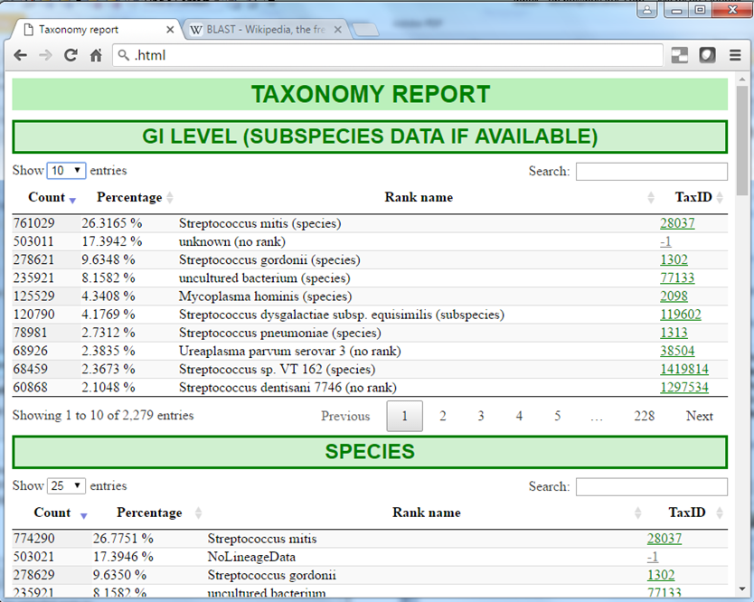

Taxonomy Reporter
=================

A metagenomics taxonomy reporting tool.

Sample outputs available via:  
  - See the docs/ folder for additional screenshots.
  - https://tin6150.github.io/taxonomy_reporter/taxorpt_sample_output.html  for interactive jQuery html output example
  - https://drive.google.com/file/d/1uTZpZQHoDoXpMn2ap0AaGFaJqB8jmg8J/view?usp=sharing has a presentation deck covering this work.

Contact me for full source code, which may need to go thru some redaction ;-)  
